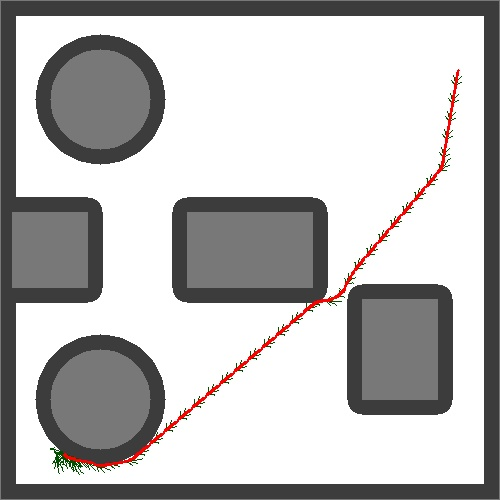

# A-star with differential contraints

### Required Modules:
- numpy, openCV, heapq

### Files Info
- 'main.py' file :
    - Map is created and Path is searched from given start to goal
- 'maputils.py' file
    - contains the map class and obstacle classes
- 'planner.py' file 
    - contains A-star class 
- 'nodeclass.py' file 
    - contains the node class

### To Run the code:
- run 'python3 main.py'
- input start and goal positions and clearance in the prompt
- change H in main.py to 1 to explore fully but takes so much time.
- after a path is found. exploration is visualized and saved as 'exploration.mp4' 

## Result

